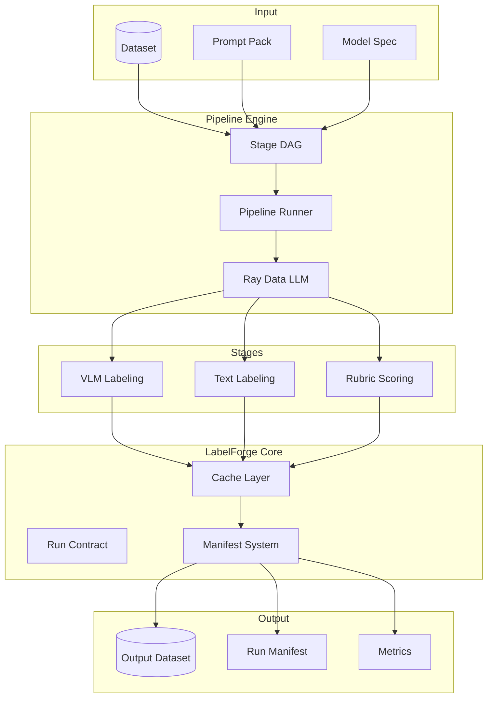

# LabelForge Architecture

## System Overview

LabelForge is a **deterministic, replayable multimodal labeling pipeline** built on Ray + vLLM.

## Core Components

### Pipeline Engine

| Component | File | Purpose |
|-----------|------|---------|
| Stage | `pipelines/stage.py` | Base class for all stages |
| DAG | `pipelines/dag.py` | Pipeline graph with dependencies |
| Runner | `pipelines/runner.py` | Orchestrates stage execution |

### LLM Integration

| Component | File | Purpose |
|-----------|------|---------|
| Processor Factory | `llm/processor_factory.py` | Creates Ray Data LLM processors |
| Determinism | `llm/determinism.py` | vLLM reproducibility toggles |
| VLM Messages | `llm/vlm_messages.py` | Multimodal message building |

### Caching

| Component | File | Purpose |
|-----------|------|---------|
| Cache Key | `cache/key.py` | Content-addressed key format |
| FS Cache | `cache/fs_cache.py` | Local filesystem backend |

### Manifest System

| Component | File | Purpose |
|-----------|------|---------|
| Run Manifest | `core/manifest/run_manifest.py` | Run-level metadata |
| Stage Manifest | `core/manifest/stage_manifest.py` | Stage-level accounting |
| Replay Planner | `core/manifest/replay_planner.py` | Deterministic replay |

## Data Flow

1. **Input**: Dataset + prompt pack + model spec
2. **DAG Resolution**: Topological sort of stages
3. **Stage Execution**: For each stage:
   - Check cache for existing results
   - Preprocess rows to LLM format
   - Execute via Ray Data LLM
   - Postprocess outputs
   - Write to manifest
   - Update cache
4. **Output**: Dataset + manifest + metrics

## Extension Points

- **New Stages**: Inherit from `Stage` base class
- **New Cache Backends**: Implement `CacheStore` interface
- **Custom Postprocessing**: Override `_create_postprocess_fn()`

See [How to Add a Stage](add_stage.md) for details.
